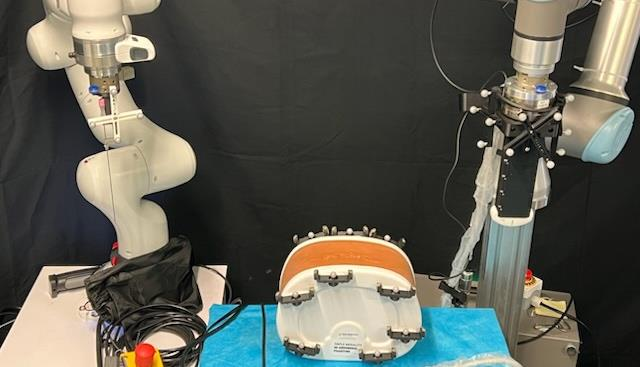
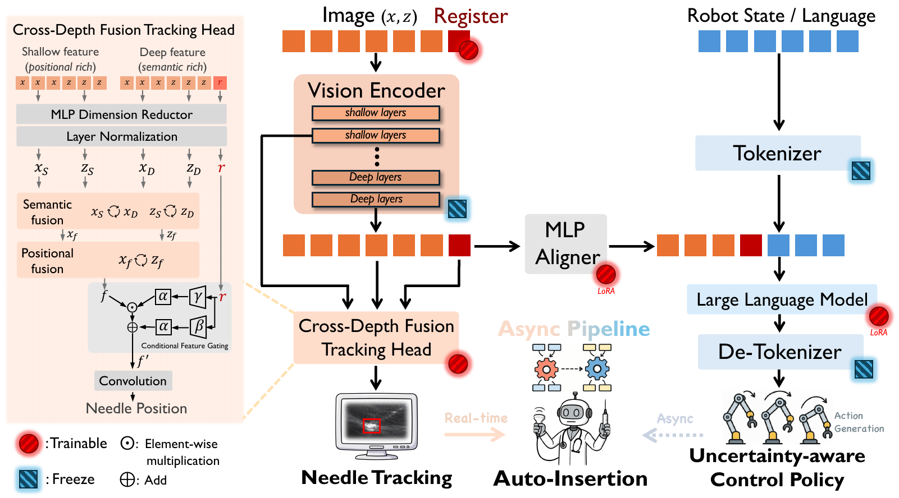
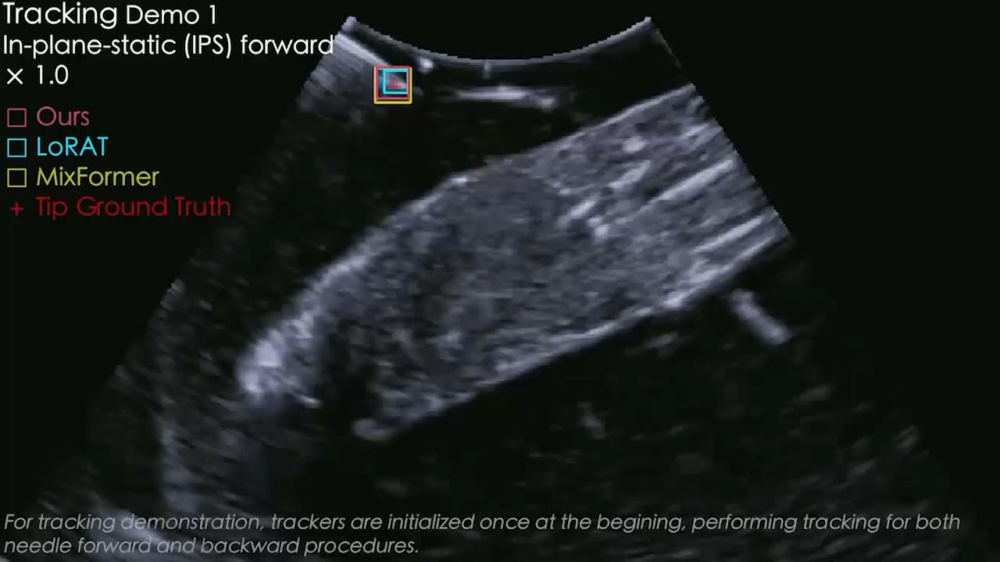

# SonoPilot

**A Vision-Language-Action Robotic System for Ultrasound-Guided Needle Intervention**

[Project Website](https://piecezhang.github.io/sonopilot/) · [Paper](https://arxiv.org/abs/2604.20347) · [Demo](https://youtu.be/dLesUszkwZw)

## Overview

SonoPilot is a research prototype that combines ultrasound perception, a vision-language-action (VLA) model, and dual-arm robotic control for adaptive needle intervention. It closes the loop between visual observation, procedural reasoning, and physical action:

**Perceive → Reason → Act → Observe**

The system is designed to:

- localize and track a needle in ultrasound images in real time;
- combine visual features, robot state, and language instructions;
- generate insertion angle, needle speed, probe motion, or a `[STOP]` action;
- slow down or stop when needle localization becomes uncertain;
- run tracking and VLA reasoning asynchronously to preserve responsive visual feedback.

## System

SonoPilot adapts the compact **Qwen2.5-VL 3B** model and introduces a **Cross-Depth Fusion Tracking Head** that combines shallow positional features with deep semantic features. An uncertainty-aware policy converts the resulting perception and context into adaptive robotic actions.

## Reported Experimental Results

| Metric | Result |
|---|---:|
| Needle localization error | **3.01 mm** |
| Real-time perception | **25.1 FPS** |
| Target-hit success rate | **80%** |
| Average intervention time | **17.3 s** |

In the reported experimental comparison, manual operation achieved a 60% target-hit success rate and an average duration of 23.2 seconds. These results come from the experimental validation described in the project presentation; they are not clinical-trial results.

## Publication

Yuelin Zhang, Qingpeng Ding, Longxiang Tang, Chengyu Fang, and Shing Shin Cheng, “A Vision-Language-Action Model for Adaptive Ultrasound-Guided Needle Insertion and Needle Tracking,” *2026 IEEE International Conference on Robotics and Automation (ICRA)*.

The work received **Best Poster Runner-Up** at the 4th Robot-Assisted Medical Imaging Workshop (ICRA-RAMI), ICRA 2026.

## Open-Source Ecosystem

- [Autonomous Needle Insertion](https://github.com/PieceZhang/autonomous_needle_insertion) — Dockerized ROS 2 platform for dual-arm ultrasound-guided needle insertion.
- [US-PPNR Dataset](https://github.com/PieceZhang/US-PPNR-Dataset) — multimodal embodied dataset for ultrasound probe placement and needle retrieval.
- [MrTrack](https://github.com/PieceZhang/MrTrack) — Mamba-based ultrasound needle tracker.
- [NeedleShapeModeling](https://github.com/PieceZhang/NeedleShapeModeling) — physics-based toolkit for real-time 3D needle-deflection estimation.

## Team and Contact

SonoPilot is developed by researchers from the **Surgical Robotics and Instrumentation Laboratory (SRIL)** at **The Chinese University of Hong Kong**, with clinical advisors from CUHK and The First Affiliated Hospital, Sun Yat-Sen University.

Research enquiries: [zhangyuelin@link.cuhk.edu.hk](mailto:zhangyuelin@link.cuhk.edu.hk)

> SonoPilot is a research prototype and is not a clinically approved product.
